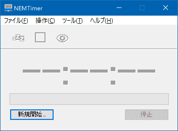
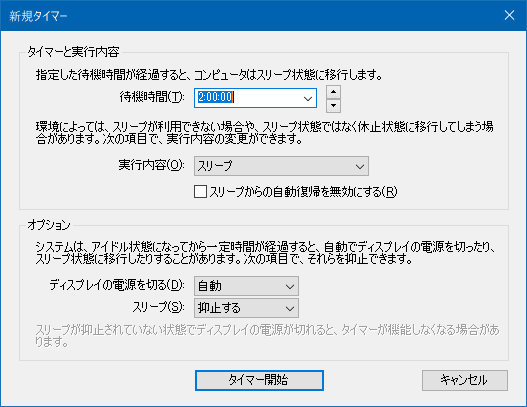
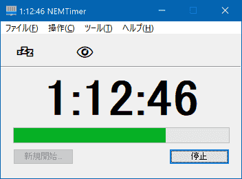

# NEMTimer

NEMTimer とは、Windows 用のソフトウェアです。

* 【動作確認】 Windows 10 Pro 1903 x64
* 【ジャンル】 ユーティリティ
* 【機能説明】 指定時間後にPCをスリープするタイマー
* 【利用代償】 フリーソフト

## ダウンロード

* [version 1.2](../../releases/download/v1.2/nemtim12.zip)

[更新履歴](../../release)

## インストール

ダウンロードした圧縮ファイルを展開後、適当な場所に保存して下さい。

## アンインストール

アンインストールは、上記ファイルを削除するだけで OK です。

## 基本的な使い方

このソフトを起動すると、ウィンドウが表示されます。

「新規開始...」を選択すると、設定画面が開きます。

待機時間などを入力し、決定すると、タイマーが開始されます。

表示されるカウントダウンの数値が 0 になると、PC がスリープ状態に移行します。

## 名前を付けて保存

メニューの「名前を付けて保存...」でショートカット※を作成できます。

**※ショートカットとは**

1. 当ソフトへの特別なショートカット(リンク/.lnk)になっています
2. 「新規開始...」で入力した**設定値が反映された状態**で、当ソフトが起動します
  * （待機時間「30:00」かつ実行内容「休止状態」に設定してタイマー開始後、「名前を付けて保存...」すると、「PC が 30 分後に休止状態に移行」するショートカットが作成されます）
3. 起動すると、**即カウントダウンが開始**されます

作成したショートカットのプロパティで、「リンク先」の項目を編集することで、自由に設定値を変えられます。たとえば、「待機時間 0 秒のショートカット」にカスタマイズすることも可能です。

## コマンドライン オプション

当ソフトをコマンドラインから引数(オプション)付きで実行したり、ショートカットのリンク先を編集したりする際には、以下の情報を利用します。

* `1000` 1000 秒
* `24::` 24 時間
* `/as` システムによる自動「スリープ」を抑止
* `/ad` システムによる自動「ディスプレイの電源を切る」を抑止
* `/a` 上記両方とも抑止
* `/h` 休止状態
* `/d` ディスプレイの電源を切る
* `/deep` スリープ状態や休止状態へ移行した後の PC が、タスクスケジューラなどによって自動復帰することを許可しない

以下のオプションは、上級者向けです。

* `/lite` UX 良好性皆無超軽量動作モード。カウントダウンのリアルタイム更新をしない
* `/debug` 開発者モード。実行内容を実行せず、メッセージボックスを表示する
